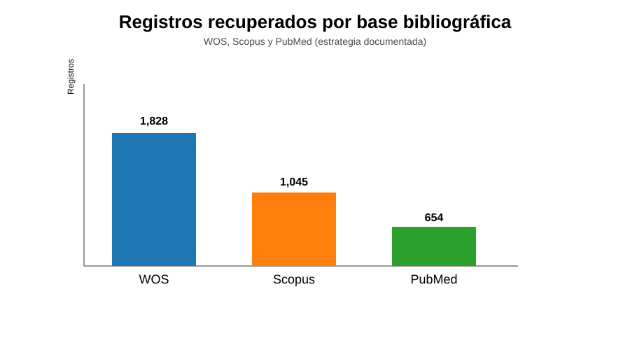
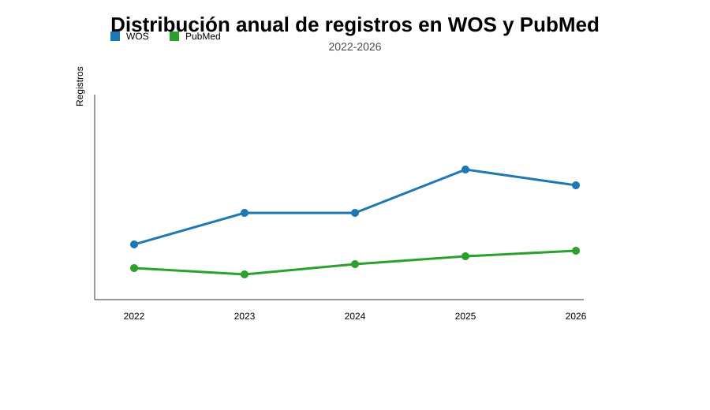

# Análisis bibliométrico de WOS, Scopus y PubMed

## Alcance del documento

Este documento integra únicamente los resultados de las bases `Web of Science (WOS)`, `Scopus` y `PubMed`, y omite el resto de fuentes analizadas en el proyecto (por ejemplo, Ovid, APA PsycInfo, Cochrane CENTRAL, Europe PMC y medRxiv). La información se basa en los datos y estrategias documentadas en el repositorio y en los archivos de exportación disponibles.

## Fuentes de evidencia

- `1 Planeación/search_strategies.md`: recuentos documentados de registros recuperados por base.
- `data/pandas_year_report.csv`: distribución anual de registros por base para WOS y PubMed.
- `data/pandas_corpus_report.csv`: recuentos del corpus derivado por base.
- `data/prisma_2020_flow_counts.csv`: flujo PRISMA general y número total de registros identificados.

## 1. Resultados de búsqueda por base

La tabla siguiente resume los registros recuperados por base según la estrategia documentada. Los valores representan los resultados de búsqueda reportados al ejecutar cada estrategia, no una estimación de relevancia final ni un conteo de estudios únicos tras deduplicación.

| Base | Registros recuperados | Participación relativa |
|---|---:|---:|
| WOS | 1,828 | 51.8% |
| Scopus | 1,045 | 29.6% |
| PubMed | 654 | 18.5% |
| Total | 3,527 | 100.0% |

La contribución más alta correspondió a WOS, seguida de Scopus y PubMed. La suma total no debe interpretarse como número de registros únicos; en la práctica, la deduplicación y el filtrado posterior reducen el volumen final del corpus.

## 2. Distribución del corpus derivado

La base de datos disponible permite reportar un recuento derivado del corpus para WOS y PubMed, mientras que Scopus no cuenta con un número separado documentado para el corpus final dentro de los archivos actuales del repositorio.

| Base | Corpus derivado | Observación |
|---|---:|---|
| WOS | 275 | Recuento documentado en `data/pandas_corpus_report.csv` |
| Scopus | NR | No reportado como corpus derivado en los archivos actuales |
| PubMed | 34 | Recuento documentado en `data/pandas_corpus_report.csv` |

Nota: la tabla anterior refleja el corpus derivado disponible en el repositorio. No se han agregado registros de Ovid, Cochrane, APA PsycInfo ni otras bases porque este documento se limita únicamente a WOS, Scopus y PubMed.

## 3. Evolución anual de los registros

El archivo `data/pandas_year_report.csv` presenta la distribución anual para WOS y PubMed. La siguiente tabla resume la evolución por año del corpus derivado reportado en ese archivo.

| Año | WOS | PubMed | Total |
|---|---:|---:|---:|
| 2022 | 21 | 7 | 28 |
| 2023 | 48 | 4 | 52 |
| 2024 | 48 | 6 | 54 |
| 2025 | 85 | 8 | 93 |
| 2026 | 73 | 9 | 82 |
| Total | 275 | 34 | 309 |

La distribución indica un crecimiento sostenido en WOS, con un máximo en 2025 (85 registros), mientras PubMed mantiene un volumen menor pero relativamente estable en los años observados. Debido a la ausencia de un conteo anual explícito para Scopus en los archivos del repositorio, la serie temporal se presenta solo para WOS y PubMed.

## 4. Interpretación bibliométrica preliminar

Los datos disponibles sugieren que:

- WOS es la base con mayor volumen de registros recuperados en la estrategia bibliométrica.
- Scopus aporta un volumen importante, pero no cuenta con un recuento del corpus final documentado dentro del conjunto actual de exportaciones.
- PubMed aporta menos volumen relativo, pero mantiene una continuidad temporal clara en la serie disponible.
- La evidencia del repositorio permite describir la producción científica en las tres bases seleccionadas, pero no sustituye la deduplicación completa ni el cribado final del conjunto de estudios.

## 5. Limitaciones metodológicas

1. El documento se limita a WOS, Scopus y PubMed; no incluye las demás bases de búsqueda del proyecto.
2. El flujo PRISMA general del repositorio reporta 943 registros identificados, pero ese valor no corresponde a una separación explícita por base para WOS/Scopus/PubMed, por lo que no se emplea como suma de la parte bibliométrica final de este manuscrito.
3. Scopus no presenta un recuento separado del corpus derivado en la evidencia actual disponible.
4. La deduplicación final de los registros y el cribado de texto completo no están reportados en esta sección, por lo que el análisis debe entenderse como descriptivo y preliminar.

## 6. Conclusión

El conjunto de resultados de búsqueda y de corpus documentados para WOS, Scopus y PubMed muestra una expansión clara de la literatura científica sobre psilocibina, depresión y ansiedad entre 2022 y 2026. Sin embargo, la interpretación del campo debe mantenerse acotada a la evidencia disponible: la descripción bibliométrica es sólida para los datos reportados, mientras que la inferencia clínica o metaanalítica requiere completar la depuración del corpus, el cribado y la síntesis final de los estudios elegibles.

## 7. Nota metodológica final

Este documento fue preparado para reflejar únicamente los resultados de WOS, Scopus y PubMed y omitir el resto de fuentes analizadas en el proyecto. Su objetivo es ofrecer una vista bibliométrica clara y separada, sin mezclar resultados no comparables ni fuentes no solicitadas por el alcance del documento.
